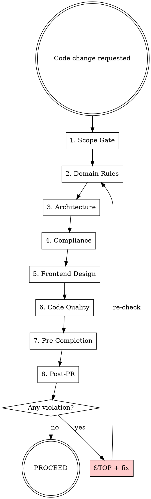

# Project Guardian — Master Shield

## Purpose

This is the **single enforcement gate** for all development work on **Political Authority Highlighter**. It orchestrates all project skills — never duplicate their content here; delegate to them. Guardian owns the orchestration flow and the items that don't belong to any sub-skill.

## When to Trigger

**ALWAYS** — before implementing ANY code change. This skill is not optional.

## Enforcement Flow



---

## 1. Scope Gate

### MVP Features (RF-001 through RF-017)

- RF-001: Politician Catalog Listing
- RF-002: Filter by Political Role
- RF-003: Filter by State (UF)
- RF-004: Integrity Score Calculation
- RF-005: Score Methodology Transparency Page
- RF-006: Anti-Corruption Exclusion Filter (silent, binary)
- RF-007: Detailed Politician Profile - Overview
- RF-008: Profile Section - Legislative Projects and Bills
- RF-009: Profile Section - Voting Record
- RF-010: Profile Section - Proposals
- RF-011: Profile Section - Agenda and Activities
- RF-012: Profile Section - Public Expenses
- RF-013: Data Ingestion Pipeline
- RF-014: Data Freshness Indicator
- RF-015: Search Politician by Name
- RF-016: Responsive Mobile Web Layout
- RF-017: SEO and Social Sharing Metadata

### Post-MVP Features (RF-018+)

- RF-018: Frontend Complete Redesign (12 phases) — see `.claude/PRPs/prds/rf-018-frontend-complete-redesign.prd.md`

### Out-of-Scope — REJECT immediately

- Comparison between politicians
- Alerts and notifications
- Public API for third parties
- Comments, reactions, or social interaction
- User registration/authentication
- Payment processing
- Native mobile apps
- Historical trend analysis
- Vereadores (municipal council members)
- News/social media integration
- Manual data entry or editorial content
- **Any feature that exposes corruption data**

---

## 2. Domain Rules — delegate to `project-domain-rules`

**REQUIRED SUB-SKILL:** Invoke `project-domain-rules` for full enforcement checklists and anti-patterns.

Quick verification table (the sub-skill has the detailed checklists):

| Rule | One-Line Check |
|------|----------------|
| DR-001: SilentExclusionInvariant | Does this change expose exclusion record details (source, date, reason) in API, UI, or logs? Politicians stay visible — only the boolean flag and a generic notice are public. |
| DR-002: PoliticalNeutralityInvariant | Does this change treat all parties/states/roles uniformly? No party colors in UI? |
| DR-003: PublicDataOnlyRule | Does every data point originate from a whitelisted government source? |
| DR-004: DataAvailabilityScoreCorrelation | Does the score formula include the data coverage multiplier? |
| DR-005: CPFNonExposureRule | Is CPF absent from API responses, frontend code, URL params, and accessible logs? |
| DR-006: NoRetaliationDesignRule | Does this create any "worst politicians" list, lowest-score sort, or negative ranking? |
| DR-007: IngestionIdempotencyRule | Are database writes idempotent (upserts with transactions)? |
| DR-008: FrontendSecurityFirstInvariant | Does this introduce data exposure, injection, or trust boundary violation in the frontend? |

### Critical Constraints (derived from domain rules)

| Constraint | Verification |
|-----------|-------------|
| CC-001: Political Neutrality | Score methodology identical across all parties. No editorializing. |
| CC-002: Corruption Never Exposed | No endpoint, page, or log reveals exclusion record details. |
| CC-003: No Retaliation | No feature enables creating hit lists or targeting politicians. |
| CC-004: Public Data Only | All data traceable to official government source with URL. |
| CC-005: CPF Confidential | CPF encrypted at rest, never in public interface. |
| CC-006: Budget Ceiling | Infrastructure change keeps total under $100/month. |

---

## 3. Architecture — delegate to `project-architecture`

**REQUIRED SUB-SKILL:** Invoke `project-architecture` for schema separation, Drizzle patterns, pg-boss rules, and infrastructure constraints.

Guardian-owned architecture checks (not in sub-skill):

### Import Boundaries (enforced by ESLint)

| Source | May Import From | Must NOT Import From |
|--------|----------------|---------------------|
| `apps/web/` | `packages/shared/` | `packages/db/`, `apps/api/`, `apps/pipeline/` |
| `apps/api/` | `packages/shared/`, `packages/db/public-schema.ts` | `packages/db/internal-schema.ts`, `apps/pipeline/` |
| `apps/pipeline/` | `packages/shared/`, `packages/db/*` (all) | `apps/web/`, `apps/api/` |
| `packages/shared/` | Nothing (zero dependencies) | Everything |
| `packages/db/` | `packages/shared/` | `apps/*` |

### Endpoint Security Check

For any new API endpoint:

- [ ] Queries only the `public` schema?
- [ ] Uses the `api_reader` database role?
- [ ] Has a TypeBox response schema (prevents field leakage)?
- [ ] Sets appropriate Cache-Control headers?
- [ ] Has rate limiting applied?
- [ ] NEVER returns CPF, exclusion records, or corruption indicator details?

---

## 4. Compliance — delegate to `project-compliance`

**REQUIRED SUB-SKILL:** Invoke `project-compliance` when the change involves:

- Personal data processing (CPF, user data)
- Privacy-related pages or features
- Security configuration (CSP, CORS, TLS)
- Cookie or analytics implementation
- New data source integration
- Backup or recovery procedures

---

## 5. Frontend Design — delegate to `web-frontend-design`

**REQUIRED SUB-SKILL:** For ANY UI change in `apps/web/`, invoke `web-frontend-design` BEFORE writing code. The sub-skill enforces the Frontend Design PRD (design tokens, typography, layout, component specs, accessibility, dark mode).

Guardian-owned UI domain invariants (the design skill owns visual/UX):

- [ ] Uses neutral color palette (no party colors)? → `web-frontend-design` section 1
- [ ] Presents data factually without qualitative judgment?
- [ ] Default sort is by highest score (never by lowest)?
- [ ] No "worst" or "bottom" ranking visible?
- [ ] Inspiration images consulted? (`docs/assets/inspirations/`)

### Frontend Security Check (DR-008)

- [ ] CSP header defined in `next.config.ts` via `headers()`?
- [ ] No `@pah/db`, `pg`, or `drizzle-orm` imports in `apps/web/`?
- [ ] No `NEXT_PUBLIC_` variables except `NEXT_PUBLIC_API_URL`?
- [ ] All API response text rendered via JSX auto-escaping (no innerHTML)?
- [ ] `dangerouslySetInnerHTML` only in JSON-LD `<script>` tags with `JSON.stringify()`?
- [ ] Error boundaries show generic messages only (no stack traces, table names, internal URLs)?
- [ ] No external scripts without `integrity` and `crossorigin` attributes?
- [ ] `import 'server-only'` present in all `packages/db/src/` files?

---

## 6. Code Quality

### TypeScript Strict Rules

- [ ] No `any` type — use `unknown` + type guards
- [ ] No `as` type assertions — except `as const` and `as unknown as T` in test factories
- [ ] No `@ts-ignore` or `@ts-expect-error` without issue link
- [ ] All public function signatures have explicit return types

### Code Style

- [ ] `interface` for object shapes; `type` for unions, intersections, mapped types
- [ ] Constants use `as const` + type alias pattern (NOT TypeScript `enum` keyword)
- [ ] All types exported by default
- [ ] Type guards used instead of type assertions
- [ ] Object destructuring used where possible
- [ ] `ms` package used for time-related configuration
- [ ] No hardcoded URLs, secrets, or environment-specific values
- [ ] New environment variables added to `.env.example`

### Git Conventions

- [ ] Branch naming: `feat/PAH-<N>-<description>`, `fix/PAH-<N>-<description>`, `chore/<description>`
- [ ] Conventional commit: `<type>(<scope>): <description>` — types: feat, fix, refactor, docs, test, chore, perf, ci

---

## 7. Pre-Completion Validation

**Before claiming any task is complete, ALL must pass:**

```bash
pnpm lint              # ESLint — zero errors
pnpm typecheck         # tsc --noEmit — zero errors
pnpm build             # Full build (Next.js + tsc) — OBRIGATÓRIO
vercel build --yes     # Vercel build simulation — OBRIGATÓRIO (CI gate)
pnpm test              # All unit tests green
```

Additional pre-PR checks:

- [ ] Database migrations are reversible (up and down)
- [ ] Import boundaries respected (no cross-boundary imports)
- [ ] No CPF values in logs, error messages, or API responses
- [ ] Public-facing text is politically neutral and factual

> **Why `pnpm build` AND `vercel build`?** `pnpm typecheck` alone is insufficient.
> `pnpm build` catches Next.js compilation errors that typecheck misses.
> `vercel build` simulates the Vercel CI environment — if it fails here, the deploy rejects the PR.

---

## 8. Post-PR Validation — delegate to `project-deploy-validator`

After creating a PR to `development`, validate the deploy:

- **Automatic:** `validate-deploy.yml` triggers after `ci.yml` completes
- **Manual:** invoke `/project-deploy-validator` in Claude Code

Only consider implementation **COMPLETE** when confirmed:

- [ ] CI (`ci.yml`) passed on GitHub Actions
- [ ] Vercel deploy confirmed (preview URL available)
- [ ] Supabase migrations applied without errors

---

## 9. CI/CD Changes — delegate to `project-cicd`

**REQUIRED SUB-SKILL:** Invoke `project-cicd` when:

- Adding a new tool or step to `.github/workflows/ci.yml`
- Adding integration tests, E2E tests, or new CI jobs
- Changing test infrastructure or adding services
- Evaluating whether a new tool belongs in CI

---

## 10. Stack Documentation — delegate to `docs-stack`

**REQUIRED SUB-SKILL:** Invoke `docs-stack` when:

- Researching external library documentation (WebFetch, WebSearch, context7)
- A new gotcha or breaking change is discovered during implementation
- A library version is upgraded

Check `docs/stack/` before fetching from web — the info may already be saved.

---

## Sub-Skill Orchestration Summary

| Sub-Skill | When to Invoke | What It Owns |
|-----------|---------------|-------------|
| `project-domain-rules` | Every code change | DR-001–DR-008 full checklists + anti-patterns |
| `project-architecture` | File creation, DB queries, dependencies, infra changes | Schema separation, Drizzle, pg-boss, Next.js ISR, monorepo structure |
| `project-compliance` | Personal data, privacy features, security config | LGPD, LAI, Marco Civil, security baseline, backup/recovery |
| `web-frontend-design` | Any `apps/web/` UI change | Design tokens, typography, layout, components, a11y, dark mode |
| `project-cicd` | CI/CD pipeline changes | Lean CI, step evaluation, security scans |
| `project-deploy-validator` | After PR to `development` | CI + Vercel + Supabase migration validation |
| `project-create-github-issue` | After plan creation or before implementation | GitHub issue from `*.plan.md` |
| `docs-stack` | External doc research or new gotcha found | Stack documentation save/update |

---

## Violation Response

If any check fails:

1. **STOP** implementation immediately
2. **Document** the violation (which rule, what was violated)
3. **Propose** a compliant alternative
4. **Get explicit approval** before proceeding

---

## Changelog

| Date | PRD Version | Summary |
|------|-------------|---------|
| 2026-02-28 | 1.0 | Initial guardian skill |
| 2026-03-07 | 1.1 | Add Frontend Security Check for DR-008 enforcement |
| 2026-03-09 | 1.2 | Schema rename public_data→public, Supabase Free tier |
| 2026-03-14 | 1.2 | Add mandatory pnpm build + vercel build before any PR |
| 2026-03-14 | 1.2 | Add post-PR validation via validate-deploy.yml |
| 2026-03-15 | 1.2 | Rewrite as master shield: orchestrates all sub-skills, fixes stale enum guidance, adds import boundaries, TypeScript strict rules, git conventions, env var management, compliance/CI/CD/docs-stack delegation |
