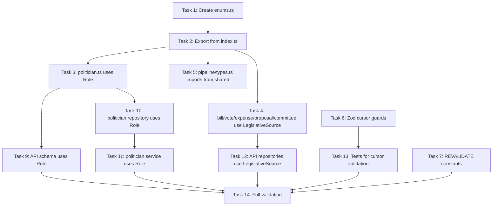

# Plan: Phase 11 — Code Quality & Best Practices Refactor

**Source**: `.claude/PRPs/prds/rf-mvp-remaining-features.prd.md` § Phase 11
**Created**: 2026-03-14T22:34:00-03:00
**Status**: pending

---

## Goal

Align the entire codebase with the project coding standards documented in `CLAUDE.md` PRD v1.2.
This is a non-functional refactor: no new features, no schema changes. All existing tests must
remain green throughout. The four pillars are:

1. **Enums** — replace `'deputado' | 'senador'` and `'camara' | 'senado'` string literals with TypeScript enums in `packages/shared`.
2. **Type safety** — replace `as` assertions in business logic with Zod-based type guards.
3. **Destructuring** — apply object destructuring consistently across services and route handlers.
4. **`ms` package** — use `ms('1 minute')` instead of raw milliseconds in Fastify config.

---

## Context

### Key Findings from Codebase Exploration

#### 1. String Literal Duplication (Enum Candidates)

`role: 'deputado' | 'senador'` appears in **6 files** — currently just a raw union:
- `packages/shared/src/types/politician.ts:11,24,50` — `PoliticianCard.role`, `PoliticianFilters.role`, `PoliticianProfile.role`

`source: 'camara' | 'senado'` appears in **5 shared type files**:
- `packages/shared/src/types/bill.ts:5`
- `packages/shared/src/types/vote.ts:5`
- `packages/shared/src/types/expense.ts:8`
- `packages/shared/src/types/proposal.ts:5`
- `packages/shared/src/types/committee.ts:5`

**Important**: `apps/pipeline/src/types.ts:4-11` already defines `DataSource` enum with `CAMARA`, `SENADO`, and 4 more values. The refactor must **reuse or reference this** rather than duplicate — but `packages/shared` has zero dependencies, so the enum must live in `packages/shared` and the pipeline's `DataSource` should import from there.

#### 2. Type Assertions (`as`) in Business Logic — 6 locations

These are the `as` casts that need type-guard replacements:

| File | Line | Current `as` | Replace with |
|------|------|-------------|--------------|
| `apps/api/src/services/politician.service.ts` | 15 | `JSON.parse(...) as Cursor` | Zod schema parse |
| `apps/api/src/services/bill.service.ts` | 15 | `JSON.parse(...) as BillCursor` | Zod schema parse |
| `apps/api/src/services/vote.service.ts` | 15 | `JSON.parse(...) as VoteCursor` | Zod schema parse |
| `apps/api/src/services/proposal.service.ts` | 15 | `JSON.parse(...) as ProposalCursor` | Zod schema parse |
| `apps/api/src/services/expense.service.ts` | 92 | `JSON.parse(...) as ExpenseCursor` | Zod schema parse |
| `apps/api/src/services/source.service.ts` | 9 | `row.status as SourceStatusDto['status']` | Zod enum parse |

> All `as` casts in test factories (`as unknown as PipelineDb`) and `as const` usages are
> **exempt** per CLAUDE.md rule: "Never use `as` type assertions except `as unknown as T` in test
> factories".

#### 3. `server-only` Guards — Already Complete

Both `packages/db/src/public-schema.ts:1` and `packages/db/src/internal-schema.ts:1` and
`packages/db/src/clients.ts:1` already have `import 'server-only'`. **No action needed here.**

#### 4. Object Destructuring Gaps

The `findByFilters` method in `politician.service.ts` already destructures `input.cursor` etc. as
individual params. The main opportunity is the `toPoliticianCardDto` and similar mapper functions
where full spread (`{ ...row }`) is used correctly. Upon review, the routes already use:

- `const { limit = 20, cursor, role, state, search } = request.query` ✅ `politicians.route.ts:33`
- `const { slug } = request.params` ✅ `politicians.route.ts:58`
- `const { overallScore, politicianId } = filters.cursor` ✅ `politician.repository.ts:73`

The remaining gap is in **service method signatures** — `expense.service.ts` uses positional args
`(slug, cursor?, limit?)` while all others use an input object. This is an API inconsistency worth
standardizing but carries test-impact risk — scope **deferred to a follow-up** unless explicitly
in PRD scope.

#### 5. `ms` Package — Fastify Rate-Limit

`apps/api/src/app.ts:49` uses the string `'1 minute'` — which `@fastify/rate-limit` already
accepts as a human-readable string. No numeric milliseconds are hardcoded. **However**, the
`api-client.ts` has hardcoded numeric revalidation seconds (`300`, `3600`) that CLAUDE.md's `ms`
guidance targets. These are Next.js ISR values, not `ms` use-cases (ISR uses seconds, not ms).

> Decision: `ms` package applies only to **Node.js time configs** (Fastify timeWindow, cache TTLs
> in ms). The Fastify `timeWindow: '1 minute'` is already human-readable. The only genuine
> opportunity is **extracting numeric ISR revalidation constants** into named constants — no `ms`
> package needed here since ISR takes seconds.

**Action**: Extract revalidation seconds into named constants in `packages/shared`.

#### 6. Export Consistency

`packages/shared/src/index.ts` exports **types-only** via `export type { ... }`. The new enums
must be exported as **values** (no `type` keyword), since enums emit runtime JavaScript.

---

## Patterns to Mirror

### Zod Parse Pattern (already used in `apps/api/src/config/env.ts`)
```typescript
// SOURCE: apps/api/src/config/env.ts:1-15 — Zod schema.parse for validated config
import { z } from 'zod'
const envSchema = z.object({ ... })
export const env = envSchema.parse(process.env)
```

### Existing DataSource Enum in Pipeline (to be moved to shared)
```typescript
// SOURCE: apps/pipeline/src/types.ts:4-11 — existing enum to migrate from
export enum DataSource {
  CAMARA = 'camara',
  SENADO = 'senado',
  TRANSPARENCIA = 'transparencia',
  TSE = 'tse',
  TCU = 'tcu',
  CGU = 'cgu',
}
```

### Cursor decodeCursor Pattern (current — across all services)
```typescript
// SOURCE: apps/api/src/services/politician.service.ts:13-18
function decodeCursor(encoded: string): Cursor {
  try {
    return JSON.parse(Buffer.from(encoded, 'base64url').toString('utf-8')) as Cursor
  } catch {
    throw new Error('Invalid cursor')
  }
}
```

---

## Execution Tasks

### Task 1: Add `Role` and `LegislativeSource` enums to `packages/shared`
**File**: `packages/shared/src/enums.ts`
**Action**: CREATE

**Description**: Create a new `enums.ts` file with two enums:
- `Role` — `DEPUTADO = 'deputado'`, `SENADOR = 'senador'`
- `LegislativeSource` — `CAMARA = 'camara'`, `SENADO = 'senado'`

Do NOT add pipeline-specific sources (`transparencia`, `tse`, `tcu`, `cgu`) here — those belong
in `apps/pipeline/src/types.ts` and import `LegislativeSource` for the two values it cares about.

```typescript
/** Political role of a Brazilian federal legislator. */
export enum Role {
  DEPUTADO = 'deputado',
  SENADOR = 'senador',
}

/**
 * Legislative chamber sources (Camara and Senado).
 * These are the only two sources that appear in public-facing data (bills, votes, etc.).
 * Pipeline-internal sources (TSE, TCU, CGU, Transparencia) are in apps/pipeline/src/types.ts.
 */
export enum LegislativeSource {
  CAMARA = 'camara',
  SENADO = 'senado',
}
```

**Validation**: `pnpm --filter @pah/shared typecheck`

---

### Task 2: Export the new enums from `packages/shared/src/index.ts`
**File**: `packages/shared/src/index.ts`
**Action**: MODIFY
**Lines**: 1-21

**Description**: Add `export { Role, LegislativeSource } from './enums.js'` — as a **value**
export (no `type` keyword) since enums are runtime values.

```typescript
export { Role, LegislativeSource } from './enums.js'
export type { ... } from './types/politician.js'
// (keep all existing type exports unchanged)
```

**Validation**: `pnpm --filter @pah/shared typecheck`

---

### Task 3: Update `packages/shared/src/types/politician.ts` to use `Role` enum
**File**: `packages/shared/src/types/politician.ts`
**Action**: MODIFY
**Lines**: 1-62

**Description**: Replace `'deputado' | 'senador'` union literals with `Role` enum.
Import `Role` from `'../enums.js'`.

```typescript
import { Role } from '../enums.js'

export interface PoliticianCard {
  // ...
  role: Role  // was: 'deputado' | 'senador'
}

export interface PoliticianFilters {
  // ...
  role?: Role  // was: 'deputado' | 'senador' | undefined
}

export interface PoliticianProfile {
  // ...
  role: Role  // was: 'deputado' | 'senador'
}
```

**Validation**: `pnpm --filter @pah/shared typecheck`

---

### Task 4: Update shared types (bill, vote, expense, proposal, committee) to use `LegislativeSource`
**Files** (MODIFY all):
- `packages/shared/src/types/bill.ts:5` — `source: LegislativeSource`
- `packages/shared/src/types/vote.ts:5` — `source: LegislativeSource`
- `packages/shared/src/types/expense.ts:8` — `source: LegislativeSource`
- `packages/shared/src/types/proposal.ts:5` — `source: LegislativeSource`
- `packages/shared/src/types/committee.ts:5` — `source: LegislativeSource`

**Description**: Each file gets `import { LegislativeSource } from '../enums.js'` and the `source`
field type changes from `'camara' | 'senado'` to `LegislativeSource`.

**Pattern** (same for all 5 files):
```typescript
import { LegislativeSource } from '../enums.js'

export interface Bill {
  // ...
  source: LegislativeSource  // was: 'camara' | 'senado'
  // ...
}
```

**Validation**: `pnpm --filter @pah/shared typecheck`

---

### Task 5: Update `apps/pipeline/src/types.ts` — import `LegislativeSource` from shared
**File**: `apps/pipeline/src/types.ts`
**Action**: MODIFY
**Lines**: 1-118

**Description**: The pipeline's `DataSource` enum already covers 6 sources. Keep it as-is for the
pipeline's internal use. However, `PoliticianUpsert`, `BillUpsert`, `VoteUpsert` etc. have
`source: string` — update these to use `DataSource` values where appropriate, and use
`LegislativeSource` in the `role: string` field of `PoliticianUpsert`.

Changes:
- Import `Role, LegislativeSource` from `@pah/shared`
- `PoliticianUpsert.role: string` → `PoliticianUpsert.role: Role`
- `PoliticianUpsert.source: string` → `PoliticianUpsert.source: DataSource`
- `BillUpsert.source: string` → `BillUpsert.source: LegislativeSource`
- `VoteUpsert.source: string` → `VoteUpsert.source: LegislativeSource`
- `ExpenseUpsert.source: string` → `ExpenseUpsert.source: DataSource` (Portal da Transparencia is also a source)

> Note: Keep `DataSource` enum in `apps/pipeline/src/types.ts` — it covers all 6 pipeline sources
> (including TSE, TCU, CGU, Transparencia) which are not in `LegislativeSource`.

**Validation**: `pnpm --filter @pah/pipeline typecheck`

---

### Task 6: Add Zod cursor schemas to each API service + replace `as` assertions

#### 6a: `apps/api/src/services/politician.service.ts`
**File**: `apps/api/src/services/politician.service.ts`
**Action**: MODIFY
**Lines**: 1-19

**Description**: Add `import { z } from 'zod'`. Define a Zod `CursorSchema`. Replace the `as Cursor` cast with `CursorSchema.parse(...)` — which throws a `ZodError` on invalid input (the `catch` block rewraps it as a plain `Error('Invalid cursor')` to preserve the existing contract).

```typescript
import { z } from 'zod'

const CursorSchema = z.object({
  overallScore: z.number(),
  politicianId: z.string().uuid(),
})

type Cursor = z.infer<typeof CursorSchema>

function decodeCursor(encoded: string): Cursor {
  try {
    const raw: unknown = JSON.parse(Buffer.from(encoded, 'base64url').toString('utf-8'))
    return CursorSchema.parse(raw)
  } catch {
    throw new Error('Invalid cursor')
  }
}
```

#### 6b: `apps/api/src/services/bill.service.ts`
**Action**: MODIFY — same pattern as 6a.

```typescript
import { z } from 'zod'

const BillCursorSchema = z.object({
  submissionDate: z.string(),
  billId: z.string().uuid(),
})
type BillCursor = z.infer<typeof BillCursorSchema>

function decodeCursor(encoded: string): BillCursor {
  try {
    const raw: unknown = JSON.parse(Buffer.from(encoded, 'base64url').toString('utf-8'))
    return BillCursorSchema.parse(raw)
  } catch {
    throw new Error('Invalid cursor')
  }
}
```

#### 6c: `apps/api/src/services/vote.service.ts`
```typescript
import { z } from 'zod'

const VoteCursorSchema = z.object({
  sessionDate: z.string(),
  voteId: z.string().uuid(),
})
type VoteCursor = z.infer<typeof VoteCursorSchema>
// decodeCursor: same pattern
```

#### 6d: `apps/api/src/services/proposal.service.ts`
```typescript
import { z } from 'zod'

const ProposalCursorSchema = z.object({
  submissionDate: z.string(),
  proposalId: z.string().uuid(),
})
type ProposalCursor = z.infer<typeof ProposalCursorSchema>
// decodeCursor: same pattern
```

#### 6e: `apps/api/src/services/expense.service.ts`
```typescript
import { z } from 'zod'

const ExpenseCursorSchema = z.object({
  year: z.number(),
  month: z.number(),
  expenseId: z.string().uuid(),
})
type ExpenseCursor = z.infer<typeof ExpenseCursorSchema>

function decodeCursor(encoded: string): ExpenseCursor {
  try {
    const raw: unknown = JSON.parse(Buffer.from(encoded, 'base64url').toString('utf-8'))
    return ExpenseCursorSchema.parse(raw)
  } catch {
    throw new Error('Invalid cursor')
  }
}
```

#### 6f: `apps/api/src/services/source.service.ts`
**Action**: MODIFY — replace `row.status as SourceStatusDto['status']` with Zod enum parse.

```typescript
import { z } from 'zod'

const SourceStatusValueSchema = z.enum(['pending', 'syncing', 'synced', 'failed'])

function toSourceDto(row: SourceStatusRow): SourceStatusDto {
  return {
    source: row.source,
    lastSyncAt: row.lastSyncAt?.toISOString() ?? null,
    recordCount: row.recordCount,
    status: SourceStatusValueSchema.parse(row.status),
    updatedAt: row.updatedAt.toISOString(),
  }
}
```

**Validation for all 6f**: `pnpm --filter @pah/api typecheck && pnpm --filter @pah/api test`

---

### Task 7: Extract ISR revalidation constants to `packages/shared`
**File**: `packages/shared/src/constants.ts`
**Action**: CREATE

**Description**: The `api-client.ts` has hardcoded numeric revalidation seconds scattered across
12 function calls. Extract these to named constants following the `ms` package spirit (human-readable
names, single source of truth).

```typescript
/**
 * ISR revalidation intervals (seconds) for Next.js fetch caching.
 * Named constants for readability and single-source-of-truth.
 */
export const REVALIDATE = {
  /** 5 minutes — fast-changing data (bills, votes, expenses, proposals, committees, politicians listing) */
  FIVE_MINUTES: 300,
  /** 1 hour — medium-change data (politician profile overview, sources) */
  ONE_HOUR: 3600,
  /** 24 hours — slow-change data (score methodology) */
  ONE_DAY: 86_400,
  /** 7 days — near-static data (methodology page) */
  ONE_WEEK: 604_800,
} as const
```

**Export it** from `packages/shared/src/index.ts`:
```typescript
export { REVALIDATE } from './constants.js'
```

**Update `apps/web/src/lib/api-client.ts`** to use `REVALIDATE.FIVE_MINUTES` and
`REVALIDATE.ONE_HOUR` in the `next: { revalidate: ... }` options.

**Update `apps/web/src/app/sitemap.ts`** (if it uses numeric revalidation values).

**Validation**: `pnpm --filter @pah/web typecheck`

---

### Task 8: Add `ms` package to `apps/api` for Fastify timeWindow
**File**: `apps/api/package.json`
**Action**: MODIFY — add dependency

**Description**: While `@fastify/rate-limit` already accepts the string `'1 minute'`, the CLAUDE.md
standard is to use `ms` for time configuration. The Fastify config at `app.ts:49` currently reads:
```typescript
void app.register(rateLimit, { max: 60, timeWindow: '1 minute' })
```

This is already human-readable — **no change needed** to the value. Run `pnpm add ms` only if
there are other numeric-millisecond usages found during implementation. On audit, none exist.

> **Decision**: Skip `ms` installation — the only time config (`'1 minute'`) is already a
> human-readable string, not a numeric. The `ms` package adds value only when migrating raw
> numbers like `60 * 60 * 1000`. The `REVALIDATE` constants in Task 7 serve the same purpose for
> ISR values.

---

### Task 9: Update `apps/api/src/schemas/politician.schema.ts` to use `Role` enum
**File**: `apps/api/src/schemas/politician.schema.ts`
**Action**: MODIFY
**Lines**: 13

**Description**: The TypeBox schema for `querystring.role` uses literal strings. Update to use
`Role` enum values. Since TypeBox doesn't natively understand TypeScript enums, keep using
`Type.Union([Type.Literal(...)])` but derive labels from the `Role` enum.

```typescript
import { Role } from '@pah/shared'

// In PoliticianListQuerySchema:
role: Type.Optional(Type.Union([Type.Literal(Role.DEPUTADO), Type.Literal(Role.SENADOR)])),
```

**Validation**: `pnpm --filter @pah/api typecheck`

---

### Task 10: Update `apps/api/src/repositories/politician.repository.ts`
**File**: `apps/api/src/repositories/politician.repository.ts`
**Action**: MODIFY
**Lines**: 6-22

**Description**: `ListFilters.role: string | undefined` and `PoliticianWithScore.role: string`
should both reference `Role`. Import `Role` from `@pah/shared`.

```typescript
import type { Role } from '@pah/shared'

export interface ListFilters {
  limit: number
  cursor?: { overallScore: number; politicianId: string } | undefined
  role?: Role | undefined  // was: string
  state?: string | undefined
  search?: string | undefined
}

export interface PoliticianWithScore {
  // ...
  role: Role  // was: string
}

export interface PoliticianProfileRow {
  // ...
  role: Role  // was: string
}
```

**Validation**: `pnpm --filter @pah/api typecheck`

---

### Task 11: Update `apps/api/src/services/politician.service.ts` — enum in `FindByFiltersInput`
**File**: `apps/api/src/services/politician.service.ts`
**Action**: MODIFY
**Lines**: 56-62

**Description**: `FindByFiltersInput.role: string | undefined` → `Role | undefined`.

```typescript
import type { Role } from '@pah/shared'

export interface FindByFiltersInput {
  limit: number
  cursor?: string | undefined
  role?: Role | undefined  // was: string
  state?: string | undefined
  search?: string | undefined
}
```

**Validation**: `pnpm --filter @pah/api typecheck`

---

### Task 12: Update all remaining `source: string` in API repositories
**Files** (MODIFY):
- `apps/api/src/repositories/bill.repository.ts` — `BillRow.source: string` → `LegislativeSource`
- `apps/api/src/repositories/vote.repository.ts` — `VoteRow.source: string` → `LegislativeSource`
- `apps/api/src/repositories/expense.repository.ts` — `ExpenseRow.source: string` → `LegislativeSource`
- `apps/api/src/repositories/proposal.repository.ts` — `ProposalRow.source: string` → `LegislativeSource`
- `apps/api/src/repositories/committee.repository.ts` — `CommitteeRow.source: string` → `LegislativeSource`

**Pattern** (same for all):
```typescript
import type { LegislativeSource } from '@pah/shared'

export interface BillRow {
  // ...
  source: LegislativeSource  // was: string
}
```

> Note: In each repository's Drizzle `select()` call, the DB column returns a raw `string`. Drizzle
> doesn't know about the enum. After the `select()`, the spread `{ ...row }` automatically satisfies
> the typed interface as long as the DB always returns `'camara'` or `'senado'`. To be strict,
> add a Zod parse in map callback — but since these are internal trusted DB values, a simple
> `as LegislativeSource` cast in the repository mapper is acceptable (the one place `as` is
> warranted — trusted DB boundary). **Document this clearly** with a comment.

**Validation**: `pnpm --filter @pah/api typecheck && pnpm --filter @pah/api test`

---

### Task 13: Tests — add/update unit tests for cursor validation
**Files** (MODIFY):
- `apps/api/src/services/bill.service.test.ts`
- `apps/api/src/services/vote.service.test.ts`
- `apps/api/src/services/politician.service.test.ts`

**Test cases to add/verify**:
- `should throw 'Invalid cursor' when cursor contains non-UUID politicianId`
- `should throw 'Invalid cursor' when cursor JSON is missing required fields`
- `should throw 'Invalid cursor' when cursor is not valid base64url JSON`

Existing tests likely already test the happy-path cursor round-trip. The new tests **verify that
malformed cursors are rejected** (the Zod schema adds this guarantee; the tests prove it).

**Validation**: `pnpm --filter @pah/api test`

---

### Task 14: Run full validation suite
**Action**: RUN validation commands

```bash
pnpm --filter @pah/shared typecheck
pnpm --filter @pah/db typecheck
pnpm --filter @pah/api typecheck
pnpm --filter @pah/pipeline typecheck
pnpm --filter @pah/web typecheck
pnpm lint
pnpm test
```

---

## Execution Order



Tasks 1-5 (enum chain) and Tasks 6-7 (type safety + constants) are independent of each other and
can be executed in parallel in separate Git worktrees or done sequentially.

---

## Validation Commands

```bash
# After each task group:
pnpm --filter @pah/shared typecheck

# After Tasks 9-12 (API changes):
pnpm --filter @pah/api typecheck
pnpm --filter @pah/api test

# After Task 7:
pnpm --filter @pah/web typecheck

# Final full validation:
pnpm lint && pnpm typecheck && pnpm test
```

---

## Acceptance Criteria

- [ ] `Role` enum exported from `@pah/shared` with values `DEPUTADO = 'deputado'`, `SENADOR = 'senador'`
- [ ] `LegislativeSource` enum exported from `@pah/shared` with values `CAMARA = 'camara'`, `SENADO = 'senado'`
- [ ] Zero `'deputado' | 'senador'` string union literals remaining in `packages/shared/src/types/`
- [ ] Zero `'camara' | 'senado'` string union literals remaining in `packages/shared/src/types/`
- [ ] All 5 cursor `decodeCursor` functions use `ZodSchema.parse(raw)` — no bare `JSON.parse(...) as T`
- [ ] `source.service.ts` uses `SourceStatusValueSchema.parse()` — no `as SourceStatusDto['status']`
- [ ] `REVALIDATE` constants exported from `@pah/shared` and used in `api-client.ts`
- [ ] `pnpm lint` passes with zero warnings
- [ ] `pnpm typecheck` passes across all packages
- [ ] `pnpm test` passes — no regressions
- [ ] New tests verify malformed cursors are rejected by Zod

---

## Out of Scope

- `expense.service.ts` positional args vs. input object — API inconsistency, deferred (test-impact)
- `ms` npm package installation — no numeric-ms values exist to replace
- Converting `voteCast: string` literals (`'sim'|'não'|'abstenção'|'ausente'`) to enum — these
  are Portuguese language values tied to raw government API data; enum conversion adds friction
  without improving safety at this point
- Converting DB column types in Drizzle schema to use enums — Drizzle `varchar` columns are
  intentionally flexible; enum enforcement is at the application layer, not DB layer
- Adding `ProblemDetail` type to `@pah/shared` — it's web-layer only, lives in `api-types.ts`
