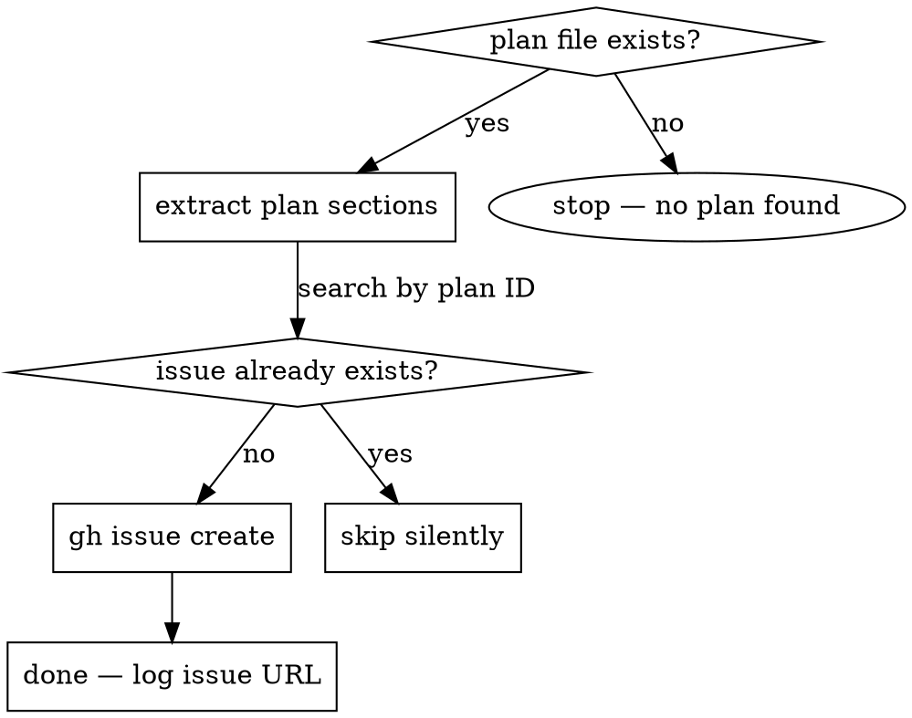

# Project — Create GitHub Issue from Plan

## Purpose

Every implementation plan (`*.plan.md`) must have a corresponding GitHub issue in the
`rodrigorjsf/political-authority-highlighter` repo. This skill creates that issue automatically
from the plan content, or validates it exists before implementation begins.

---

## When to Use

**Trigger 1 — After plan creation:**
Run this skill immediately after `/prp-core:prp-plan` saves a new `*.plan.md` file.

**Trigger 2 — Before/during implementation:**
When `/prp-core:prp-implement` is invoked, check whether a GitHub issue already exists for
the plan being implemented. If not, create it **in parallel** — do NOT block or delay the
implementation skill. Fire-and-forget via background agent.

---

## Workflow



---

## Step-by-Step Procedure

### Step 1 — Locate the plan file

The plan file path is usually passed as context (e.g., `.claude/PRPs/plans/rf-015-name-search.plan.md`).
If not provided, look for the most recently modified `*.plan.md` in `.claude/PRPs/plans/`.

### Step 2 — Check if an issue already exists

Extract the plan identifier from the filename (e.g., `rf-015`, `dr-008`, `phase-11`):

```bash
gh issue list \
  --repo rodrigorjsf/political-authority-highlighter \
  --search "rf-015 in:title" \
  --json number,title \
  --limit 5
```

If the output contains a matching issue (title includes the plan ID or summary keywords),
**stop here** — log the existing issue URL and return. Do not create a duplicate.

### Step 3 — Read the plan and extract sections

Read the plan file and extract these sections (see `references/issue-template.md` for the
complete extraction rules):

| Issue Field | Plan Section |
|------------|-------------|
| Title | First `#` heading (strip `Plan:` prefix) |
| Summary | `## Summary` |
| User Story | `## User Story` |
| Problem Statement | `## Problem Statement` |
| Solution Statement | `## Solution Statement` |
| Metadata table | `## Metadata` |
| Files to Change | `## Files to Change` (table) |
| NOT Building | `## NOT Building` |
| Acceptance Criteria | `## Acceptance Criteria` |
| Validation Commands | `## Validation Commands` (Levels 1–3 only) |
| Plan Reference | Relative path from repo root |

### Step 4 — Determine labels

Based on the plan's `## Metadata` table:

- `Type = NEW_CAPABILITY` → label `feature`
- `Type = BUG_FIX` → label `bug`
- `Type = REFACTOR` → label `refactor`
- `Type = CHORE` → label `chore`
- `Complexity = LOW` → label `complexity:low`
- `Complexity = MEDIUM` → label `complexity:medium`
- `Complexity = HIGH` → label `complexity:high`
- Always add label `plan`

Create missing labels before creating the issue:

```bash
gh label create "plan" --color "0052CC" --description "Issue created from a plan file" \
  --repo rodrigorjsf/political-authority-highlighter 2>/dev/null || true

gh label create "complexity:medium" --color "FBCA04" --description "Medium complexity" \
  --repo rodrigorjsf/political-authority-highlighter 2>/dev/null || true
```

### Step 5 — Create the GitHub issue

Use `gh issue create` with a HEREDOC body. Follow the template in
`references/issue-template.md` exactly.

```bash
gh issue create \
  --repo rodrigorjsf/political-authority-highlighter \
  --title "feat: {plan title}" \
  --label "feature,complexity:medium,plan" \
  --body "$(cat <<'EOF'
## Summary

{summary from plan}

---

## User Story

{user story from plan}

---

## Problem Statement

{problem statement from plan}

---

## Solution Statement

{solution statement from plan}

---

## Metadata

| Field | Value |
|-------|-------|
| Type | {type} |
| Complexity | {complexity} |
| Systems Affected | {systems} |
| Estimated Tasks | {N} |
| Dependencies | {deps} |

---

## Files to Change

| File | Action | Justification |
|------|--------|---------------|
{files to change rows}

---

## NOT Building (Scope Limits)

{not building bullet list}

---

## Acceptance Criteria

{acceptance criteria checkboxes}

---

## Validation Commands

\`\`\`bash
{validation commands levels 1-3}
\`\`\`

---

## Plan Reference

Full implementation plan: \`.claude/PRPs/plans/{plan-filename}\`
EOF
)"
```

After creation, **print the issue URL** so the user can see it.

---

## Integration with prp-core:prp-implement

When `/prp-core:prp-implement` is invoked:

1. **Do NOT block** the implementation workflow.
2. In parallel (background), run Steps 1–5 of this skill.
3. If the issue is created successfully, log: `GitHub issue created: {URL}`
4. If it already exists, log: `GitHub issue already exists: {URL} — skipping`
5. Implementation continues regardless of this skill's outcome. A failure here (network, auth)
   must not interrupt the implementation.

---

## Common Mistakes

| Mistake | Fix |
|---------|-----|
| Creating duplicate issues | Always run Step 2 (search) before Step 5 (create) |
| Using the filename as the title | Extract the `#` H1 heading from the plan instead |
| Omitting `--repo` flag | Always specify `--repo rodrigorjsf/political-authority-highlighter` |
| Label creation failing and blocking | Use `2>/dev/null \|\| true` on `gh label create` |
| Blocking implementation on issue creation | Issue creation is fire-and-forget; never await it when in implement mode |
| Including Risks/Notes/Patterns in the issue | Keep issues concise — omit `## Risks`, `## Notes`, `## Patterns to Mirror` |
