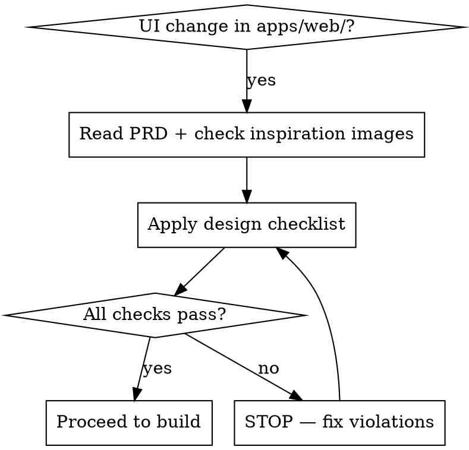

# Web Frontend Design Enforcement

## Critical Rule — No Exceptions

**Every implementation touching `apps/web/` UI MUST comply with the Frontend Design PRD at `docs/prd/frontend_design_prd.md` and draw inspiration from `docs/assets/inspirations/`.**

Violating the letter of these rules is violating the spirit of the rules.



---

## 1. Design Token Enforcement

Before writing a single Tailwind class, verify every token maps to the PRD palette.

### Colors — Use ONLY these semantic tokens

| Semantic Role | Light Mode | Dark Mode | Tailwind Class |
|---|---|---|---|
| Background Base | `#FFFFFF` | `#0B0E14` | `bg-white` / `dark:bg-[#0B0E14]` |
| Surface/Card | `#F8FAFC` | `#161B22` | `bg-slate-50` / `dark:bg-[#161B22]` |
| Border/Divider | `#E2E8F0` | `#30363D` | `border-slate-200` / `dark:border-[#30363D]` |
| Primary (Trust Blue) | `#1D4ED8` | `#3B82F6` | `text-blue-700` / `dark:text-blue-500` |
| Success (Integrity Green) | `#16A34A` | `#22C55E` | `text-green-600` / `dark:text-green-500` |
| Warning/Accent (Yellow) | `#D97706` | `#FACC15` | `text-amber-600` / `dark:text-yellow-400` |
| Text Primary | `#0F172A` | `#F8FAFC` | `text-slate-900` / `dark:text-slate-50` |
| Text Muted | `#64748B` | `#94A3B8` | `text-slate-500` / `dark:text-slate-400` |

**REJECT any color outside this palette** unless explicitly justified.

**NEVER use party colors** (red/blue political associations, warm reds, strong partisan tones).

### Typography

- **UI/Reading font:** `Inter` or `Plus Jakarta Sans` — apply to all body text, headings, labels
- **Data/Numbers font:** `JetBrains Mono` or `Roboto Mono` — use ONLY for integrity scores, financial values, process numbers
- **Minimum font size:** `14px` (`text-sm`) — never below this
- **Base size:** `16px` (`text-base`)
- **Headings:** `font-bold` or `font-extrabold` + `tracking-tight`

### Spacing & Border Radius

- **Spacing:** Strict 4px grid — `p-4`, `m-6`, `gap-8` etc. (Tailwind defaults)
- **Cards/Containers:** `rounded-2xl` or `rounded-xl`
- **Buttons/Badges:** `rounded-lg` or `rounded-md`
- **Tags/Pills:** `rounded-full`

---

## 2. Layout & Responsiveness

| Breakpoint | Grid | Navigation |
|---|---|---|
| Mobile `< 640px` | `grid-cols-1` | Bottom Tab Bar (44px touch targets) |
| Tablet `640–1024px` | 2-column Bento Grid | Collapsible side drawer |
| Desktop `> 1024px` | 3–4 column Bento Grid | Fixed left sidebar (280px wide) |

- Main content area: `max-w-7xl` on desktop
- Header: Glassmorphism sticky — `backdrop-blur-md bg-white/70 dark:bg-[#0B0E14]/70`
- Complex tables → stacked vertical cards on mobile
- Sidebars → Bottom Tab Navigation on mobile

---

## 3. Component-Specific Rules

### Politician Profile Card (Bento Grid)

- Avatar: `rounded-full`
- Name: `<h2>` with bold weight
- Role: `text-muted` class
- Integrity Gauge: Semi-circle SVG, stroke color → Green if score ≥ 80, Yellow if 50–79, otherwise muted. Center number uses `JetBrains Mono`
- Tags: `bg-green-100 text-green-800 dark:bg-green-900/30 dark:text-green-400 rounded-full`

### Data Tables

- No inner borders; rows separated by `border-b border-slate-200 dark:border-slate-800`
- Row hover: `hover:bg-slate-50 dark:hover:bg-white/5`
- Actions: right-aligned chevron icon
- Mobile: convert to stacked cards

### Buttons

- **Primary:** `bg-blue-600 text-white shadow-sm rounded-lg`
- **Secondary:** `border border-slate-300 bg-transparent rounded-lg`
- **Hover:** `hover:-translate-y-[1px] transition-all duration-200 ease-in-out`
- All interactive states required: `default`, `hover`, `focus`, `active`, `disabled`
- Focus ring: `focus:ring-2 focus:ring-blue-500 focus:outline-none`

---

## 4. Motion & Micro-Interactions

- **Page transitions:** Fade `opacity-0 → opacity-100` over `300ms`
- **Loading:** Skeleton screens (`animate-pulse bg-slate-200 dark:bg-slate-800`) matching content shape — **NEVER generic spinners** for main content
- **Tooltips:** Dark background, `duration-150` fade-in, trigger on `hover` (desktop) / `tap` (mobile)

---

## 5. Accessibility (WCAG 2.1 AA — Mandatory)

- [ ] All charts, icons, and interactive elements have descriptive `aria-label`
- [ ] Minimum touch target: `44×44px` (especially mobile nav)
- [ ] Keyboard navigation fully supported
- [ ] Focus rings visible and high-contrast: `focus:ring-2 focus:ring-blue-500 focus:outline-none`
- [ ] Font size never below `14px`
- [ ] Contrast ratio ≥ 4.5:1 for text (WCAG AA)
- [ ] Language: neutral, educational, no legal jargon ("juridiquês")

---

## 6. UX Copywriting Rules

- Tone: neutral, educational, optimistic
- Target reading level: average Brazilian citizen
- Use tooltips to explain civic/legal terminology instead of showing raw jargon
- Example: use "Condenação por mau uso de dinheiro público" with a tooltip instead of raw "Ato de Improbidade Administrativa"

---

## 7. Design Checklist (Run Before Every UI PR)

**Color & Theme**

- [ ] All colors use PRD semantic tokens only
- [ ] Dark mode variants defined for every color token used
- [ ] No party-associated colors

**Typography**

- [ ] UI text uses Inter or Plus Jakarta Sans
- [ ] Scores/numbers use JetBrains Mono or Roboto Mono
- [ ] No font size below `text-sm` (14px)

**Layout**

- [ ] Mobile-first: works at 320px minimum width
- [ ] Responsive breakpoints: 1-col mobile → 2-col tablet → 3-4 col desktop
- [ ] Sidebar converts to Bottom Tab on mobile

**Components**

- [ ] All interactive states implemented (hover, focus, active, disabled)
- [ ] Cards use `rounded-xl` or `rounded-2xl`
- [ ] Buttons follow primary/secondary specs
- [ ] Table rows have correct hover state

**Accessibility**

- [ ] `aria-label` on all icons, charts, interactive elements
- [ ] Touch targets ≥ 44×44px
- [ ] Focus rings present and visible
- [ ] No generic spinners for main content loads

**Vibe Check**

- [ ] Matches modern SaaS aesthetic (NOT legacy government portal)
- [ ] Clean lines, subtle glassmorphism in header
- [ ] Data is the hero — score visible first, details behind progressive disclosure
- [ ] Compare against inspiration images in `docs/assets/inspirations/` before submitting

---

## 8. Inspiration References

### 8.1 Local Inspiration Images

Study the images in `docs/assets/inspirations/` before implementing:

| Category | Path | Use For |
|---|---|---|
| Profiles | `docs/assets/inspirations/profile/` | Score gauges, bento grid layout, stat cards |
| Components | `docs/assets/inspirations/components/` | Tables, lists, sidebars, headers, footers |
| Homepage | `docs/assets/inspirations/homepage/` | Hero sections, call-to-action layouts |

Key patterns observed:

- Clean sidebar with icon + text nav, subtle active state highlight
- Data tables with avatar column, status badges (`rounded-full`), right-aligned actions
- Score/gauge charts centered in profile bento cards with number below
- Stats displayed as large mono-font numbers with muted labels
- Glassmorphism header with centered or left-aligned logo

### 8.2 Sloth UI — Figma Design Reference

**Sloth UI** (<https://www.slothui.com/>) is a Figma-based atomic design kit with a modern minimalist
SaaS-dashboard aesthetic, WCAG 2.1 accessible defaults, dark/light mode variants, and Phosphor icons.

**When to use:** Consult it when planning the visual layout of a new page or complex component
_before_ writing code. It helps visualise spacing, hierarchy, and component variants in Figma-style
mockups.

**How to use:**

1. Browse <https://www.slothui.com/> for component anatomy, layout patterns, and atomic design conventions
2. Extract the visual patterns (spacing rhythm, card hierarchy, icon treatment) and map them to the
   PRD design tokens from this skill
3. **Do NOT import SlothUI as a code dependency** — it is Figma-only with no npm package or Tailwind
   integration. All code implementation must use Tailwind CSS + shadcn/ui following the PRD tokens

**Useful for this project:**

- Gauge/score card anatomy and spacing
- Sidebar nav active-state treatment
- Data-dense dashboard bento cell proportions
- Button and badge variant mapping

---

## 9. Red Flags — STOP and Redesign

| What you're about to do | Why it's wrong |
|---|---|
| "I'll add the dark mode styles later" | Dark mode is mandatory now, not after |
| "The spinner is good enough for loading" | Skeleton screens are required for main content |
| "This color looks close enough" | Only exact PRD tokens are allowed |
| "The mobile layout is basically the same as desktop" | Mobile-first means designed for mobile first |
| "I'll add aria-labels in a later pass" | Accessibility is a first-class requirement |
| "This is a small component, the PRD doesn't apply" | The PRD applies to EVERY UI element, no size exceptions |
| "I'll use a party color to distinguish politicians" | Party colors are forbidden — DR-002: Political Neutrality |

---

## 10. Full PRD Reference

The complete Frontend Design PRD (design tokens, typography scale, component specs, responsiveness rules) is at:

```
docs/prd/frontend_design_prd.md
```

Read it before implementing any new page or component. It is the authoritative source.

---

## Changelog

| Date | Summary |
|------|---------|
| 2026-03-15 | Initial skill — enforces Frontend Design PRD v1.0 compliance across apps/web/ |
