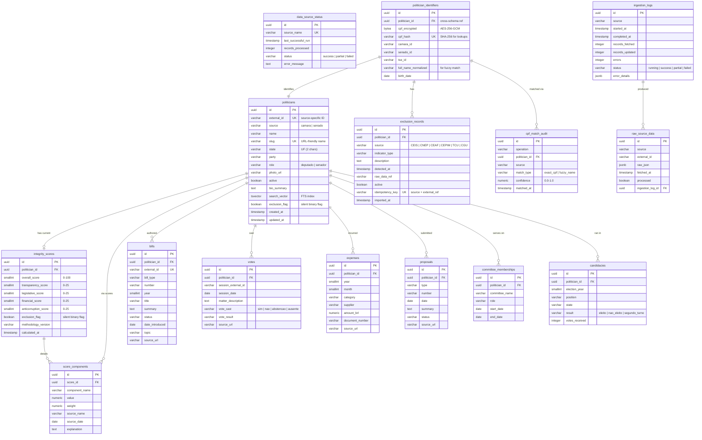

# Entity-Relationship Model — Political Authority Highlighter

> **Version:** 1.0 | **Last Updated:** 2026-02-28

---

## Entity Relationship Diagram



---

## Schema Separation

| Aspect | `public_data` Schema | `internal_data` Schema |
|--------|---------------------|----------------------|
| **DB Role** | `api_reader` (SELECT only) | `pipeline_admin` (ALL) |
| **Tables** | 10 tables | 5 tables |
| **Contains** | Politician profiles, scores, parliamentary activity, candidacies | CPFs (encrypted), exclusion records, raw data, audit logs |
| **Accessed by** | Fastify API, Next.js (via API) | Pipeline worker only |
| **Sensitive data** | None (by design) | CPF (AES-256-GCM encrypted), corruption records |
| **Cross-schema bridge** | `exclusion_flag` boolean on `politicians` and `integrity_scores` | `politician_id` FK referencing `public_data.politicians` |

---

## Entity Descriptions

### politicians
- **Purpose:** Central entity representing a Brazilian federal legislator (deputado federal or senador). Serves as the primary lookup and display entity for all public-facing features.
- **Schema:** `public_data`
- **Compliance scope:** None (public data only; no personal identifiers)
- **Key attributes:**

| Name | Type | Constraints | Description |
|------|------|-------------|-------------|
| id | uuid | PK, auto-generated | Internal unique identifier |
| external_id | varchar | UNIQUE | Source-specific identifier (e.g., Camara deputado ID) |
| source | varchar | NOT NULL | Origin source: `camara` or `senado` |
| name | varchar | NOT NULL | Full name as published by the source |
| slug | varchar | UNIQUE, NOT NULL | URL-friendly name for profile pages (e.g., `joao-silva-sp`) |
| state | varchar(2) | NOT NULL | Brazilian state abbreviation (UF) |
| party | varchar | NOT NULL | Current party abbreviation |
| role | varchar | NOT NULL | `deputado` or `senador` |
| photo_url | varchar | NULLABLE | URL to official photo |
| active | boolean | NOT NULL, DEFAULT true | Whether currently in office |
| bio_summary | text | NULLABLE | Brief biographical summary |
| search_vector | tsvector | GIN indexed | Full-text search vector for name search (RF-015) |
| exclusion_flag | boolean | NOT NULL, DEFAULT false | Silent binary flag set by pipeline when exclusion records exist (DR-001) |
| created_at | timestamp | NOT NULL, DEFAULT now() | Record creation timestamp |
| updated_at | timestamp | NOT NULL, DEFAULT now() | Last update timestamp |

- **Domain rules:** DR-002 (treated uniformly), DR-003 (data from government sources only), DR-006 (no negative exposure)

---

### integrity_scores
- **Purpose:** Stores the computed integrity score and its 4 component scores for each politician. Versioned by `methodology_version` to track algorithm changes.
- **Schema:** `public_data`
- **Compliance scope:** None
- **Key attributes:**

| Name | Type | Constraints | Description |
|------|------|-------------|-------------|
| id | uuid | PK | Unique score record identifier |
| politician_id | uuid | FK -> politicians.id, NOT NULL | Reference to the scored politician |
| overall_score | smallint | NOT NULL, CHECK (0-100) | Composite integrity score |
| transparency_score | smallint | NOT NULL, CHECK (0-25) | Data availability across sources (DR-004) |
| legislative_score | smallint | NOT NULL, CHECK (0-25) | Bill authorship, vote participation, committee activity |
| financial_score | smallint | NOT NULL, CHECK (0-25) | Expense regularity, no irregular accounts |
| anticorruption_score | smallint | NOT NULL, CHECK (0-25) | Binary: 25 (clean) or 0 (exclusion records exist) |
| exclusion_flag | boolean | NOT NULL, DEFAULT false | Mirror of DR-001 enforcement |
| methodology_version | varchar | NOT NULL | Algorithm version string for reproducibility |
| calculated_at | timestamp | NOT NULL | When the score was computed |

- **Domain rules:** DR-001 (exclusion_flag is the only corruption data in public schema), DR-002 (uniform weights), DR-004 (data availability correlation)

---

### score_components
- **Purpose:** Granular breakdown of each score dimension, providing transparency into how each sub-metric contributed to the final score. Supports the methodology transparency page (RF-005).
- **Schema:** `public_data`
- **Compliance scope:** None
- **Key attributes:**

| Name | Type | Constraints | Description |
|------|------|-------------|-------------|
| id | uuid | PK | Unique component identifier |
| score_id | uuid | FK -> integrity_scores.id, NOT NULL | Parent score record |
| component_name | varchar | NOT NULL | Name of the sub-metric (e.g., `vote_participation_rate`) |
| value | numeric | NOT NULL | Computed value for this sub-metric |
| weight | numeric | NOT NULL | Weight applied (uniform per DR-002) |
| source_name | varchar | NOT NULL | Which data source contributed this metric |
| source_date | date | NULLABLE | Date of the source data used |
| explanation | text | NULLABLE | Human-readable explanation of the calculation |

- **Domain rules:** DR-002 (uniform weights), DR-003 (source attribution)

---

### bills
- **Purpose:** Legislative projects (projetos de lei) authored or co-authored by a politician. Supports RF-008 (profile bills section).
- **Schema:** `public_data`
- **Compliance scope:** None
- **Key attributes:**

| Name | Type | Constraints | Description |
|------|------|-------------|-------------|
| id | uuid | PK | Unique bill identifier |
| politician_id | uuid | FK -> politicians.id, NOT NULL | Author/co-author |
| external_id | varchar | UNIQUE, NOT NULL | Source-specific bill identifier |
| bill_type | varchar | NOT NULL | Type (PL, PLP, PEC, etc.) |
| number | varchar | NOT NULL | Bill number |
| year | smallint | NOT NULL | Year introduced |
| title | varchar | NOT NULL | Short title |
| summary | text | NULLABLE | Bill summary/ementa |
| status | varchar | NOT NULL | Current status (tramitando, aprovado, arquivado, etc.) |
| date_introduced | date | NOT NULL | Date the bill was presented |
| topic | varchar | NULLABLE | Subject area classification |
| source_url | varchar | NOT NULL | Link to official source (DR-003) |

- **Domain rules:** DR-003 (verifiable source URL)

---

### votes
- **Purpose:** Record of how a politician voted in legislative sessions. Supports RF-009 (voting record section) and the legislative score component.
- **Schema:** `public_data`
- **Compliance scope:** None
- **Key attributes:**

| Name | Type | Constraints | Description |
|------|------|-------------|-------------|
| id | uuid | PK | Unique vote record identifier |
| politician_id | uuid | FK -> politicians.id, NOT NULL | The voting politician |
| session_external_id | varchar | NULLABLE | Source-specific session identifier |
| session_date | date | NOT NULL | Date of the voting session |
| matter_description | text | NOT NULL | Description of what was voted on |
| vote_cast | varchar | NOT NULL | `sim`, `nao`, `abstencao`, or `ausente` |
| vote_result | varchar | NULLABLE | Overall session result |
| source_url | varchar | NULLABLE | Link to official source |

- **Domain rules:** DR-003 (verifiable source)

---

### expenses
- **Purpose:** Parliamentary expenses (CEAP for deputados, CEAPS for senadores). Supports RF-012 (expenses section) and the financial score component.
- **Schema:** `public_data`
- **Compliance scope:** None (public expense data under LAI)
- **Key attributes:**

| Name | Type | Constraints | Description |
|------|------|-------------|-------------|
| id | uuid | PK | Unique expense record identifier |
| politician_id | uuid | FK -> politicians.id, NOT NULL | The spending politician |
| year | smallint | NOT NULL | Expense year |
| month | smallint | NOT NULL, CHECK (1-12) | Expense month |
| category | varchar | NOT NULL | Expense category (e.g., passagens aereas, combustiveis) |
| supplier | varchar | NULLABLE | Supplier/vendor name |
| amount_brl | numeric(12,2) | NOT NULL | Amount in Brazilian Real |
| document_number | varchar | NULLABLE | Fiscal document reference |
| source_url | varchar | NULLABLE | Link to official source |

- **Domain rules:** DR-003 (verifiable source)

---

### proposals
- **Purpose:** Formal proposals (requerimentos, indicacoes, etc.) submitted by a politician. Supports RF-010 (proposals section).
- **Schema:** `public_data`
- **Compliance scope:** None
- **Key attributes:**

| Name | Type | Constraints | Description |
|------|------|-------------|-------------|
| id | uuid | PK | Unique proposal identifier |
| politician_id | uuid | FK -> politicians.id, NOT NULL | Proposing politician |
| type | varchar | NOT NULL | Proposal type (requerimento, indicacao, etc.) |
| number | varchar | NOT NULL | Proposal number |
| date | date | NOT NULL | Submission date |
| summary | text | NULLABLE | Brief description |
| status | varchar | NOT NULL | Current status |
| source_url | varchar | NULLABLE | Link to official source |

- **Domain rules:** DR-003 (verifiable source)

---

### committee_memberships
- **Purpose:** Tracks politician participation in parliamentary committees. Supports RF-011 (agenda/activities section) and the legislative score component.
- **Schema:** `public_data`
- **Compliance scope:** None
- **Key attributes:**

| Name | Type | Constraints | Description |
|------|------|-------------|-------------|
| id | uuid | PK | Unique membership identifier |
| politician_id | uuid | FK -> politicians.id, NOT NULL | The committee member |
| committee_name | varchar | NOT NULL | Name of the committee |
| role | varchar | NOT NULL | Role in committee (membro, presidente, relator, etc.) |
| start_date | date | NOT NULL | Membership start date |
| end_date | date | NULLABLE | Membership end date (NULL if current) |

- **Domain rules:** None specific

---

### candidacies
- **Purpose:** Electoral history from TSE data. Tracks past candidacies, results, and votes received. Provides historical context on politician profiles.
- **Schema:** `public_data`
- **Compliance scope:** None (public electoral data)
- **Key attributes:**

| Name | Type | Constraints | Description |
|------|------|-------------|-------------|
| id | uuid | PK | Unique candidacy identifier |
| politician_id | uuid | FK -> politicians.id, NOT NULL | The candidate |
| election_year | smallint | NOT NULL | Election year |
| position | varchar | NOT NULL | Position sought (deputado federal, senador, etc.) |
| state | varchar(2) | NOT NULL | State where candidacy was registered |
| result | varchar | NOT NULL | `eleito`, `nao_eleito`, `segundo_turno` |
| votes_received | integer | NULLABLE | Number of votes received |

- **Domain rules:** DR-003 (TSE public data)

---

### data_source_status
- **Purpose:** Tracks the health and freshness of each data source ingestion. Supports RF-014 (data freshness indicator) and operational monitoring.
- **Schema:** `public_data`
- **Compliance scope:** None
- **Key attributes:**

| Name | Type | Constraints | Description |
|------|------|-------------|-------------|
| id | uuid | PK | Unique status record identifier |
| source_name | varchar | UNIQUE, NOT NULL | Source identifier (`camara`, `senado`, `transparencia`, `tse`, `tcu`, `cgu`) |
| last_successful_run | timestamp | NULLABLE | Last time the source was successfully synced |
| records_processed | integer | NOT NULL, DEFAULT 0 | Number of records processed in last run |
| status | varchar | NOT NULL | `success`, `partial`, or `failed` |
| error_message | text | NULLABLE | Error details if status is not `success` |

- **Domain rules:** DR-007 (idempotent ingestion status)

---

### politician_identifiers
- **Purpose:** Maps politicians to their identifiers across all data sources. Stores encrypted CPF for cross-source matching. This is the identity resolution hub of the pipeline.
- **Schema:** `internal_data`
- **Compliance scope:** LGPD (contains CPF personal data)
- **Key attributes:**

| Name | Type | Constraints | Description |
|------|------|-------------|-------------|
| id | uuid | PK | Unique identifier |
| politician_id | uuid | FK -> public_data.politicians.id, NOT NULL | Cross-schema reference to public entity |
| cpf_encrypted | bytea | NOT NULL | CPF encrypted with AES-256-GCM (application-layer key) |
| cpf_hash | varchar | UNIQUE, NOT NULL | SHA-256 hash of normalized CPF for matching without decryption |
| camara_id | varchar | NULLABLE | Camara dos Deputados identifier |
| senado_id | varchar | NULLABLE | Senado Federal identifier |
| tse_id | varchar | NULLABLE | TSE candidate identifier |
| full_name_normalized | varchar | NULLABLE | Normalized name (no diacritics, uppercase) for fuzzy matching |
| birth_date | date | NULLABLE | Used as secondary matching criterion |

- **Domain rules:** DR-005 (CPF never exposed), DR-007 (idempotent matching)

---

### exclusion_records
- **Purpose:** Stores records of politicians found in anti-corruption databases (CEIS, CNEP, CEAF, CEPIM, TCU CADIRREG, CGU-PAD). These records drive the silent exclusion mechanism. Their content NEVER leaves the internal schema.
- **Schema:** `internal_data`
- **Compliance scope:** LGPD (sensitive data about individuals)
- **Key attributes:**

| Name | Type | Constraints | Description |
|------|------|-------------|-------------|
| id | uuid | PK | Unique record identifier |
| politician_id | uuid | FK -> politician_identifiers.politician_id, NOT NULL | The affected politician |
| source | varchar | NOT NULL | Source database: `CEIS`, `CNEP`, `CEAF`, `CEPIM`, `TCU`, `CGU` |
| indicator_type | varchar | NOT NULL | Type of exclusion indicator |
| description | text | NULLABLE | Description from the source database |
| detected_at | timestamp | NOT NULL | When the record was first detected by the pipeline |
| raw_data_ref | varchar | NULLABLE | Reference to the raw_source_data record |
| active | boolean | NOT NULL, DEFAULT true | Whether the exclusion is currently active |
| idempotency_key | varchar | UNIQUE, NOT NULL | `source + external_ref` for deduplication (DR-007) |
| imported_at | timestamp | NOT NULL, DEFAULT now() | Import timestamp |

- **Domain rules:** DR-001 (never exposed publicly), DR-006 (no retaliation), DR-007 (idempotent via idempotency_key)

---

### ingestion_logs
- **Purpose:** Audit trail for every pipeline execution. Tracks what was fetched, how many records were processed, and any errors encountered. Essential for debugging data quality issues.
- **Schema:** `internal_data`
- **Compliance scope:** None
- **Key attributes:**

| Name | Type | Constraints | Description |
|------|------|-------------|-------------|
| id | uuid | PK | Unique log identifier |
| source | varchar | NOT NULL | Source name (`camara`, `senado`, etc.) |
| started_at | timestamp | NOT NULL | Job start time |
| completed_at | timestamp | NULLABLE | Job completion time (NULL if still running) |
| records_fetched | integer | NOT NULL, DEFAULT 0 | Records fetched from source |
| records_updated | integer | NOT NULL, DEFAULT 0 | Records upserted into the database |
| errors | integer | NOT NULL, DEFAULT 0 | Number of errors encountered |
| status | varchar | NOT NULL | `running`, `success`, `partial`, or `failed` |
| error_details | jsonb | NULLABLE | Structured error information |

- **Domain rules:** DR-007 (supports idempotency verification)

---

### raw_source_data
- **Purpose:** Raw data preservation layer. Stores the original JSON/CSV payloads fetched from government sources before transformation. Enables re-processing without re-fetching and provides an audit trail for data provenance.
- **Schema:** `internal_data`
- **Compliance scope:** LGPD (may contain CPF in raw payloads; encrypted at rest via disk encryption)
- **Key attributes:**

| Name | Type | Constraints | Description |
|------|------|-------------|-------------|
| id | uuid | PK | Unique raw data identifier |
| source | varchar | NOT NULL | Source name |
| external_id | varchar | NOT NULL | Source-specific record identifier |
| raw_json | jsonb | NOT NULL | Original payload as received from the source |
| fetched_at | timestamp | NOT NULL | When the data was fetched |
| processed | boolean | NOT NULL, DEFAULT false | Whether this record has been transformed and loaded |
| ingestion_log_id | uuid | FK -> ingestion_logs.id, NULLABLE | Parent ingestion run |

- **Domain rules:** DR-007 (deduplication via source + external_id)

---

### cpf_match_audit
- **Purpose:** Audit log for cross-source identity matching operations. Records every CPF hash match or fuzzy name match attempt, enabling investigation of matching quality and false positive rates.
- **Schema:** `internal_data`
- **Compliance scope:** LGPD (references politician identifiers)
- **Key attributes:**

| Name | Type | Constraints | Description |
|------|------|-------------|-------------|
| id | uuid | PK | Unique audit record identifier |
| operation | varchar | NOT NULL | Operation type (e.g., `ingest_camara`, `ingest_tse`) |
| politician_id | uuid | FK -> politician_identifiers.politician_id, NOT NULL | The matched politician |
| source | varchar | NOT NULL | Data source being matched |
| match_type | varchar | NOT NULL | `exact_cpf` (SHA-256 hash match) or `fuzzy_name` (name + state + birth_date) |
| confidence | numeric(3,2) | NOT NULL | Match confidence: 1.0 for exact CPF, 0.0-0.99 for fuzzy |
| matched_at | timestamp | NOT NULL, DEFAULT now() | When the match was performed |

- **Domain rules:** DR-005 (no CPF in audit records, only politician_id reference), DR-007 (idempotent matching)

---

## Key Indexes

```sql
-- public_data schema
CREATE INDEX idx_politicians_slug ON public_data.politicians(slug);
CREATE INDEX idx_politicians_state ON public_data.politicians(state);
CREATE INDEX idx_politicians_party ON public_data.politicians(party);
CREATE INDEX idx_politicians_role ON public_data.politicians(role);
CREATE INDEX idx_politicians_search ON public_data.politicians USING GIN(search_vector);
CREATE INDEX idx_politicians_active ON public_data.politicians(active) WHERE active = true;
CREATE INDEX idx_scores_politician ON public_data.integrity_scores(politician_id);
CREATE INDEX idx_scores_overall ON public_data.integrity_scores(overall_score DESC);
CREATE INDEX idx_bills_politician ON public_data.bills(politician_id);
CREATE INDEX idx_expenses_politician_year ON public_data.expenses(politician_id, year, month);

-- internal_data schema
CREATE UNIQUE INDEX idx_identifiers_cpf_hash ON internal_data.politician_identifiers(cpf_hash);
CREATE INDEX idx_exclusions_identifier ON internal_data.exclusion_records(politician_id);
CREATE UNIQUE INDEX idx_exclusions_idempotency ON internal_data.exclusion_records(idempotency_key);
CREATE INDEX idx_raw_data_unprocessed ON internal_data.raw_source_data(processed) WHERE processed = false;
```
